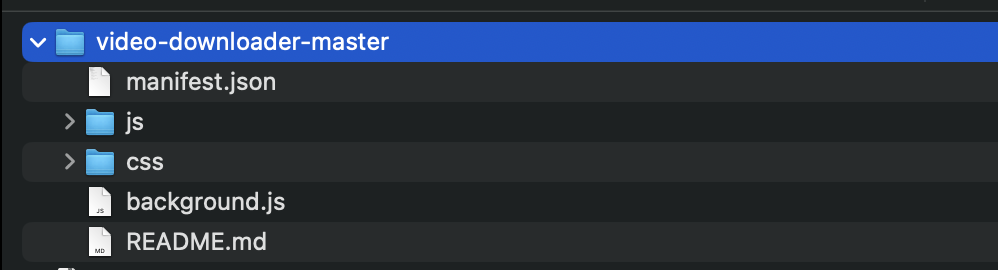
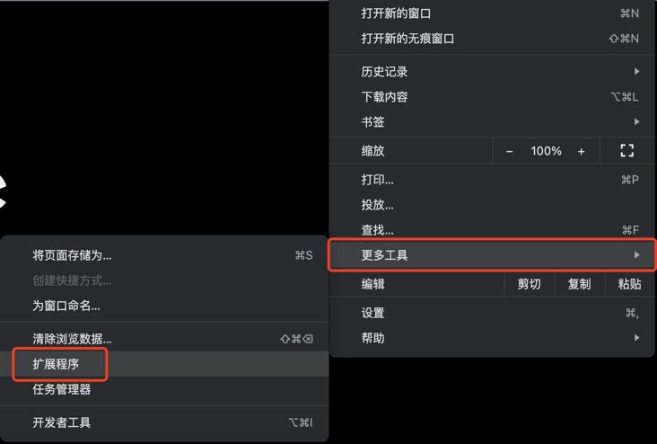
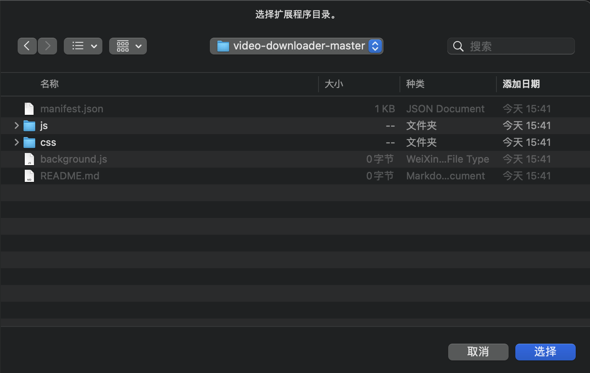
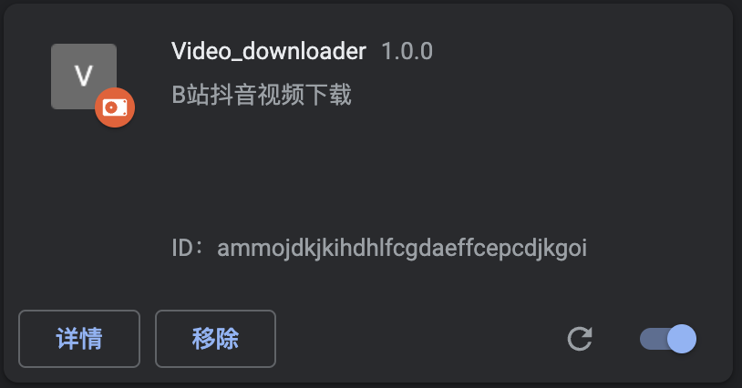
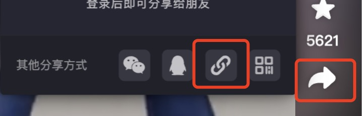
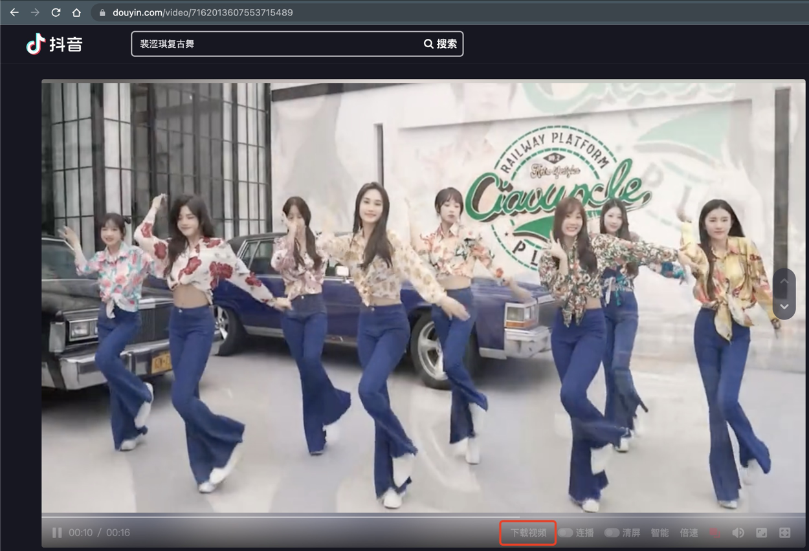
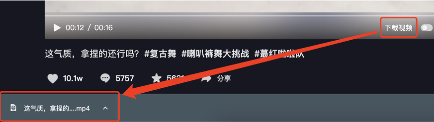
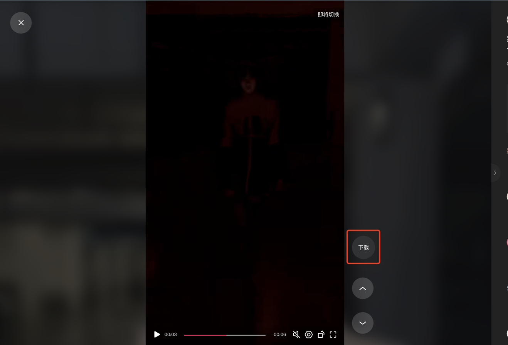

#### 操作系统环境
* `MacOS`
* `Windows`
* `Linux`
#### 浏览器环境
* `Chrome 90+`

#### 插件安装步骤
* 下载安装`Chrome`浏览器，[点击下载](https://www.google.cn/intl/zh-CN/chrome/),已经安装的可以跳过此步骤。
* 下载插件 [点击下载](https://github.com/airb3/video-downloader),链接：`https://github.com/airb3/video-downloader`，并解压下载好的压缩包为文件夹。

* 打开`Chrome`浏览器，点击右上角3个点，依次选择更多工具->扩展程序。

* 打开右上角【开发者模式】按钮。

* 点击左上角【加载已解压的扩展程序】，选择刚刚我们解压好的文件夹，点击【选择】，Windows环境的操作方法类似。

* 浏览器扩展界面出现下图中的内容即安装成功。

#### 插件使用步骤
##### 抖音
* 在手机或电脑中，找到自己想下载的视频，点击右下角分享按钮，复制成`链接`。

* 找一个地方，粘贴一下刚刚复制的内容，把`https`开头的那一串链接复制下来。

* 在电脑浏览器中粘贴复制的链接，并按下键盘回车，访问。

* 此时，播放器下方会有一个【下载视频】按钮，点击此按钮数秒内将会自动下载好视频。

##### 快手
* 在手机或电脑端，选择要下载的视频，点击右下角分享按钮，复制链接。

* 在电脑浏览器中，粘贴链接访问视频。

* 界面中会出现【下载】按钮，点击后，数秒内会完成视频下载。
##### B站
稍微复杂，敬请期待